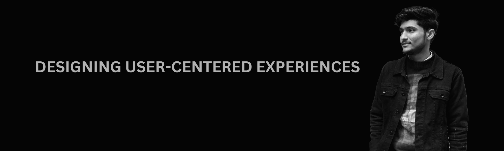

<h1 align="center">Hi 👋, I'm Tushar Singh</h1>
<h3 align="center">A passionate UI/UX Designer from India</h3>

- 👨‍💻 All of my projects are available at [https://singhtushar.netlify.app/](https://singhtushar.netlify.app/)

- 💬 Ask me about **User Interface and Graphic Designing**

- 📫 How to reach me **singhtushar4411@gmail.com**

<h3 align="left">Connect with me:</h3>

<h3 align="left">Languages and Tools:</h3>

      

