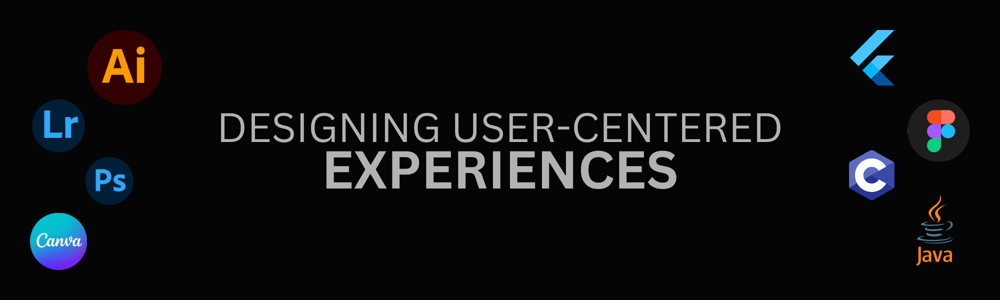

<h1 align="center">Hi 👋, I'm Tushar Singh</h1>
<h3 align="center">A passionate UI/UX Designer from India</h3>

  

  

  

- 🌱 I’m currently learning **Web Development**

- 👨‍💻 All of my projects are available at [https://tushar-singh.netlify.app/](https://tushar-singh.netlify.app/)

- 💬 Ask me about **Ask me about User Interface and Graphic Designing**

<h3 align="left">Connect with me:</h3>

<h3 align="left">Languages and Tools:</h3>

            

